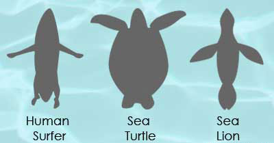

```{r, echo=FALSE, message=FALSE, warning=FALSE}
library(tidyverse)
library(lubridate)
library(Quandl)
library(dplyr)
library(ggplot2)
library(stringr)
library(broom)
library(forcats)
library(ggmap)
library(leaflet)
library(readr)
library(colorspace)
```


```{r, echo=FALSE, message=FALSE, cache=TRUE}
# Do not edit this code block. By setting cache=TRUE, we are saving the output 
# of this block to the cache. That way it only needs to run once.  This is
# especially useful for portions of code that take a long time to run.
attacks <- read_csv("~/Desktop/Middlebury/Data Science/Final-Project/attacks.csv")
```


## Admistrative:
* The URL of the RPubs published URL [here](http://rpubs.com/kyragray/final-writeup).

## Abstract: 
The analysis conducted in the this project explores data drawm from a global shark attacks database dating back to the 1500s that can be accessed [here](https://www.kaggle.com/teajay/global-shark-attacks) on Kaggle. The data originally comes from the [Global Shark Attack File](http://www.sharkattackfile.net/index.htm) which I have assumed got its data from the [International Shark Attack File](https://www.flmnh.ufl.edu/fish/isaf/home/), due to some specific similarities in the description of the ISAF's database and the data I worked with. The original dataset included 16 original variables and of those 16 the variables that proved most relevant to my anlysis were Year, Type of Attack (provoked vs unprovoked), Country, Area, Location, the Activity was victim was engaging in when the attack occured, Injury, and Fatal (Y/N). 

By creating leaflet plots of the location of each attack, I was able to portray regional trends of where attacks are happening by each variable of interest. Generally, shark attacks occur in the same overall regions across the globe, however there are slight location based trends for attacks that were fatal or occured while the victim was engaging an activity that was Board Involved, Fishing Involved Swimming/Diving. Additionally, the logistic regression model for predicting the fatality of an attack (using Activity, Location, and Type) accurately predicted a fatal attack 70% of the time. 

## Introduction: 
I was raised to love the beach and swimming in the ocean and therefore have never developed an intense fear of sharks while swimming, however, I realized that this was a reality for many people. Perhaps this is due to the portrayal of sharks in the media and in film, such as the success of the 1975 film “Jaws” or due to their foreboding appearance. However the actual likelihood of being attacked by a shark is incredibly low according to the website of the International Shark Attack File ([ISAF](https://www.flmnh.ufl.edu/fish/isaf/what-are-odds/risks-comparison/)). Therefore, speaking probabilistically there are many other aquatic/oceanic activity and animals that we should fear more than we fear sharks. As far as beach related activities, more people are killed by sand and you are 290 times more likely to die in a boating accident, 132 times more likely to drown at the beach, 45 times more likely to die in a rip current,   than to be killed by a shark. And as far as other animals we should fear in lieu of sharks, you are twice more likely to be killed by an alligator or a bear than a shark. While the precise accuracy of these rates may not be exact, the general notion that a shark attack is extremely unlikely holds. And yet, people are terrified of sharks. It is because of this over-exaggerated fear that I decided to explore the dynamics and patterns at play in shark attacks over time and across the globe.

```{r, echo=TRUE, message=TRUE, warning=TRUE, fig.width=8, fig.height=4.5}


```

[HowStuffWorks](http://adventure.howstuffworks.com/shark-attack.htm)

Now it is important to realize that humans are not the natural prey of sharks. Our meat is in fact not high enough in fat to be fitting for a shark’s diet. A shark’s diet actually consists of fish, sea turtles, seals, sea lions, and whales. And when we realize what a human surfer looks like from a shark swimming below, we can see how similar that silhouette looks to other species that sharks prey on for food making it easier to understand that sharks often mistaken when they attack humans, not preying on humans intentionally. Additionally, considering that fish are also a major part of sharks’ diets, it becomes reasonable to believe that human shark interactions that occur close in proximity to fishing (e.g. near activities such as chumming the waters) are perhaps more likely to result in an attack. The activity that the victim was involved in when the shark attack occurred proved central to my exploration and analysis of this data set. 

## Data: 
I initially found my data on Reddit’s dataset [page](https://www.reddit.com/r/datasets/) which linked to [Kaggle](https://www.kaggle.com/teajay/global-shark-attacks), which functions as a “platform for predictive modeling and analytics competitions.” The dataset I used was posted by someone under the username “toby jolly” and was updated about 2 months ago. The name of the dataset is “Global Shark Attacks” and is described as “data compiled from the global shark attack file.” The dataset was in CSV format and consisted initially of 16 variables and 5992 observations or attacks. The Kaggle page for this dataset drew the data from a compilation created by the Global Shark Attack File [GSAF](http://www.sharkattackfile.net/index.htm). However, after conducting more research on the history of a global shark attack data base, I realized that the data was most likely pulled initially from the International Shark Attack File, which was founded after a conference hosted in 1958 due to the US Navy’s particular interest in researching viable strategies to prevent shark attacks. According to the International Shark Attack File’s website, it stands as the “longest running database on shark attacks” and has “now more than 5900 individual investigations housed the File” which is precisely the amount of observations in the dataset I explored, making me realize that the GSAF probably pulled their data from the [ISAF](https://www.flmnh.ufl.edu/fish/isaf/home/) database. 

## Limitations: 
Unfortunately there are many limitations of my analysis due to the nature of my dataset. Firstly, there is just the question of whether all shark attacks are even reported to this database in the first place. Presumably it would require the victim or someone aware of the attack to know about the database in order to ultimately report the attack. While this may be fair to assume is true in areas with large population of well-educated health care professionals and access to computers/internet, this may not be as fair to assume in more remote or developing countries. Additionally, the issue of bad press for tourism could result into the discouragement of reporting a shark attack. We will see the effects of the inception of the ISAF on how many shark attacks “happened”(or were reported) in the year after its establishment in 1958. 

Another limitation of my analysis arises from not only whether attacks are reported but also how they are reported. The dataset is incredibly text heavy and the responses were not limited to set answers, rather the reports of each attack were all incredibly unique. For example, this biggest issue this caused was for the variable “Activity” (the activity the victim was engaging in when the attack occurred). The responses to this question were not limited to a asset number of different options that one would likely be doing when attacked by a shark (e.g. Swimming, Fishing, Surfing, etc.). Instead, many of the entries were longer, personalized, and high anecdotal. For example: “Swimming after a tennis ball” was one response and despite the fact that the victim was simply swimming, the more specific is coded and recognized differently from all the other victims who simply entered “Swimming.” Now, that particular example was not difficult to remedy using the “mutate” and “grepl” functions in dplyr and stringr respectively. However, there were over 1400 unique observations for the Activity variable and thus it was difficult to anticipate all the different ways people would describe essentially the same activity. Yet, in the end when I made the most general six classification bins for my predictive model, only a little under 15% of the data fell into the “Other” category but it is important to acknowledge that there is always something lost when sorting categorical variables into more general bins and that the decisions I made in categorizing them may be different from how someone else would do so (similarly to how each MATH216 student engaged with the OkCupid Data differently). 

The last major limitation of my analysis originated from issues with the way the location of the attacks was entered. There were three variables that covered the location of the attack: Country, Area, Location so for example there was an attack at the beach that I have grown up going to every summer and it was entered as Country=USA, Area=New Jersey, Location=Bay Head, Ocean County. However, that observation is an example of an ideal entry. Because I aspired to conduct location based analysis of the shark attacks I needed to obtain the latitude and longitude coordinates of each attack. This required the use of the “geocode” function in the ggmaps package, which essentially can input a character string of text (made from using the “unite” function from the stringr package to unite Location, Area, Country into one string) through the Google Maps search engine and retrieves an output of the latitude and longitude coordinates of that search. However, the caveat to the success of this function working is that the search reaps a result, which is not always the case for a variety of issues. One issue I encountered was that whenever a string with special characters (generally accented letters for the French language) was encountered the function would stop working all together. After many attempts to remedy this problem while still salvaging the locations with the “bad” character strings, I unfortunately had to remove them all together for the sake of moving forward with the project. Once the “bad” character strings were removed, even then some “good” character strings which Google Maps was able to search did not ultimately reap a result and thus the geocode function would enter a NA for the coordinates. However, even after removing all the observations that had “bad” location character strings or didn't results in useable coordinates, I was left with 3,011 observations to work with, which is 50% of the data set clearly indicated a major limitation to any location based analysis I conduct.  With the exception of the limitation due to the uncertainty about whether or not this database captured all of shark attacks to ever occur across the globe, the other limitations could be more properly addressed in the future with a long time frame for the project. I could spend more time pouring over the Activity variable to make sure I classified each of the 1400 unique entries correctly. Additionally, I could find a solution for the “bad” character strings and the locations that didn't reap a result from the Google maps search (for example sometimes this occurred when the search was too large of an area like a whole county as opposed to a town within the county). 


```{r, echo=FALSE, message=FALSE, warning=FALSE, fig.width=12, fig.height=6}
attacks <- attacks %>% 
  tibble::rownames_to_column(var="id_internal")
```

## Cleaning Up the Data:

Cleaning up this data set, particularly the Activity variable proved to be very time consuming but also rewarding. Using the stringr package's grepl function over and over again, I was able to identify and recategorize observation into more general "buckets" so as to not have over 1400 unique activity observations. Now obviously some decisions were made here that could have been made differently. This recategorization is my first attempt after pouring over the 1400 observations and taking note of language patterns. Later on I make more generalized categorizations for the sake of a predictive model. The most decision-making in this portion of the project was probably made for what to classify as "Fishing"" and "Air or Sea Disaster" and so for the sake of not displaying lines and lines of grepl code, I have only shown the Activity variable cleaning code for those two categorical buckets. 

```{r, echo=FALSE, message=FALSE, warning=FALSE, fig.width=12, fig.height=6}
attacks <- attacks %>%
  ##Renaming Activities 
  mutate(Activity1 = Activity) %>% 
    ##Wading
    mutate(Activity1 = ifelse(grepl("Wading", Activity), "Wading", Activity1)) %>% 
    mutate(Activity1 = ifelse(grepl("wading", Activity), "Wading", Activity1)) %>% 
    ##Standing
    mutate(Activity1 = ifelse(grepl("Standing", Activity), "Standing", Activity1)) %>% 
    mutate(Activity1 = ifelse(grepl("standing", Activity), "Standing", Activity1)) %>% 
    mutate(Activity1 = ifelse(grepl("Stamding", Activity), "Standing", Activity1)) %>% 
    ##Playing
    mutate(Activity1 = ifelse(grepl("Playing", Activity), "Playing", Activity1)) %>% 
    mutate(Activity1 = ifelse(grepl("playing", Activity), "Playing", Activity1)) %>% 
    ##Fell
    mutate(Activity1 = ifelse(grepl("Fell", Activity), "Fell", Activity1)) %>% 
    mutate(Activity1 = ifelse(grepl("fell", Activity), "Fell", Activity1)) %>% 
    mutate(Activity1 = ifelse(grepl("Overboard", Activity), "Fell", Activity1)) %>% 
    mutate(Activity1 = ifelse(grepl("overboard", Activity), "Fell", Activity1)) %>% 
    ##Bathing
    mutate(Activity1 = ifelse(grepl("Bathing", Activity), "Bathing", Activity1)) %>% 
    mutate(Activity1 = ifelse(grepl("bathing", Activity), "Bathing", Activity1)) %>% 
    mutate(Activity1 = ifelse(grepl("Bathe", Activity), "Bathing", Activity1)) %>% 
    mutate(Activity1 = ifelse(grepl("bathe", Activity), "Bathing", Activity1)) %>% 
    mutate(Activity1 = ifelse(grepl("Bath", Activity), "Bathing", Activity1)) %>% 
    mutate(Activity1 = ifelse(grepl("bath", Activity), "Bathing", Activity1)) %>% 
    ##Treading water 
    mutate(Activity1 = ifelse(grepl("Treading water", Activity), "Treading Water", Activity1)) %>% 
    mutate(Activity1 = ifelse(grepl("treading water", Activity), "Treading Water", Activity1)) %>% 
    mutate(Activity1 = ifelse(grepl("Treading", Activity), "Treading Water", Activity1)) %>% 
    mutate(Activity1 = ifelse(grepl("treading", Activity), "Treading Water", Activity1)) %>% 
    ##Washing
    mutate(Activity1 = ifelse(grepl("Washing", Activity), "Washing", Activity1)) %>% 
    mutate(Activity1 = ifelse(grepl("washing", Activity), "Washing", Activity1)) %>% 
    ##Murder
    mutate(Activity1 = ifelse(grepl("Murder", Activity), "Murder", Activity1)) %>% 
    mutate(Activity1 = ifelse(grepl("murder", Activity), "Murder", Activity1)) %>% 
    mutate(Activity1 = ifelse(grepl("Murdered", Activity), "Murder", Activity1)) %>% 
    mutate(Activity1 = ifelse(grepl("murdered", Activity), "Murder", Activity1)) %>% 
    ##Splashing
    mutate(Activity1 = ifelse(grepl("Splashing", Activity), "Splashing", Activity1)) %>% 
    mutate(Activity1 = ifelse(grepl("splashing", Activity), "Splashing", Activity1)) %>% 
    mutate(Activity1 = ifelse(grepl("Splash", Activity), "Splashing", Activity1)) %>% 
    mutate(Activity1 = ifelse(grepl("splash", Activity), "Splashing", Activity1)) %>% 
    ##Walking 
    mutate(Activity1 = ifelse(grepl("Walking", Activity), "Walking", Activity1)) %>% 
    mutate(Activity1 = ifelse(grepl("walking", Activity), "Walking", Activity1)) %>% 
    mutate(Activity1 = ifelse(grepl("Walk", Activity), "Walking", Activity1)) %>% 
    mutate(Activity1 = ifelse(grepl("walk", Activity), "Walking", Activity1)) %>% 
    ##Rowing
    mutate(Activity1 = ifelse(grepl("Rowing", Activity), "Rowing", Activity1)) %>% 
    mutate(Activity1 = ifelse(grepl("rowing", Activity), "Rowing", Activity1)) %>% 
    ##Floating
    mutate(Activity1 = ifelse(grepl("Floating", Activity), "Floating", Activity1)) %>% 
    mutate(Activity1 = ifelse(grepl("floating", Activity), "Floating", Activity1)) %>% 
    ##Paddling
    mutate(Activity1 = ifelse(grepl("Paddling", Activity), "Paddling", Activity1)) %>% 
    mutate(Activity1 = ifelse(grepl("Sculling", Activity), "Paddling", Activity1)) %>% 
    mutate(Activity1 = ifelse(grepl("paddling", Activity), "Paddling", Activity1)) %>% 
    mutate(Activity1 = ifelse(grepl("Paddle", Activity), "Paddling", Activity1)) %>% 
    mutate(Activity1 = ifelse(grepl("paddle", Activity), "Paddling", Activity1)) %>% 
    ##Body Surfing
    mutate(Activity1 = ifelse(grepl("Body Surfing", Activity), "Body Surfing", Activity1)) %>% 
    mutate(Activity1 = ifelse(grepl("Body surfing", Activity), "Body Surfing", Activity1)) %>% 
    #Snorkeling
    mutate(Activity1 = ifelse(grepl("Snorkeling", Activity), "Snorkeling", Activity1)) %>% 
    mutate(Activity1 = ifelse(grepl("snorkeling", Activity), "Snorkeling", Activity1)) %>% 
    ##Kite Boarding
    mutate(Activity1 = ifelse(grepl("Kite Boarding", Activity), "Kite Boarding", Activity1)) %>% 
    mutate(Activity1 = ifelse(grepl("Kite boarding", Activity), "Kite Boarding", Activity1)) %>% 
    mutate(Activity1 = ifelse(grepl("Kite-boarding", Activity), "Kite Boarding", Activity1)) %>% 
    mutate(Activity1 = ifelse(grepl("Kiteboarding", Activity), "Kite Boarding", Activity1)) %>% 
    mutate(Activity1 = ifelse(grepl("Kite-Boarding", Activity), "Kite Boarding", Activity1)) %>%
    ##Canoeing
    mutate(Activity1 = ifelse(grepl("Canoeing", Activity), "Canoeing", Activity1)) %>% 
    mutate(Activity1 = ifelse(grepl("canoeing", Activity), "Canoeing", Activity1)) %>% 
    mutate(Activity1 = ifelse(grepl("canoe", Activity), "Canoeing", Activity1)) %>% 
    mutate(Activity1 = ifelse(grepl("Canoe", Activity), "Canoeing", Activity1)) %>% 
    ##Kayaking
    mutate(Activity1 = ifelse(grepl("Kayaking", Activity), "Kayaking", Activity1)) %>% 
    mutate(Activity1 = ifelse(grepl("kayaking", Activity), "Kayaking", Activity1)) %>% 
    mutate(Activity1 = ifelse(grepl("Kayak", Activity), "Kayaking", Activity1)) %>% 
    mutate(Activity1 = ifelse(grepl("kayak", Activity), "Kayaking", Activity1)) %>% 
    ##Boogie Boarding
    mutate(Activity1 = ifelse(grepl("Boogie Boarding", Activity), "Boogie Boarding", Activity1)) %>% 
    mutate(Activity1 = ifelse(grepl("Boogie boarding", Activity), "Boogie Boarding", Activity1)) %>% 
    mutate(Activity1 = ifelse(grepl("boogie boarding", Activity), "Boogie Boarding", Activity1)) %>% 
    mutate(Activity1 = ifelse(grepl("Body Boarding", Activity), "Boogie Boarding", Activity1)) %>% 
    mutate(Activity1 = ifelse(grepl("Body boarding", Activity), "Boogie Boarding", Activity1)) %>% 
    mutate(Activity1 = ifelse(grepl("Bodyboarding", Activity), "Boogie Boarding", Activity1)) %>% 
    mutate(Activity1 = ifelse(grepl("Body-boarding", Activity), "Boogie Boarding", Activity1)) %>% 
    mutate(Activity1 = ifelse(grepl("body board", Activity), "Boogie Boarding", Activity1)) %>% 
    ##Paddleboarding
    mutate(Activity1 = ifelse(grepl("Paddleboarding", Activity), "Paddleboarding", Activity1)) %>% 
    mutate(Activity1 = ifelse(grepl("Paddle boarding", Activity), "Paddleboarding", Activity1)) %>% 
    mutate(Activity1 = ifelse(grepl("Paddle-boarding", Activity), "Paddleboarding", Activity1)) %>% 
    mutate(Activity1 = ifelse(grepl("Stand-Up Paddleboarding", Activity), "Paddleboarding", Activity1)) %>% 
    mutate(Activity1 = ifelse(grepl("SUP", Activity), "Paddleboarding", Activity1)) %>% 
    mutate(Activity1 = ifelse(grepl("Paddle Boarding", Activity), "Paddleboarding", Activity1)) %>% 
    mutate(Activity1 = ifelse(grepl("Paddleboarding", Activity), "Paddleboarding", Activity1)) %>% 
    ##Jumping
    mutate(Activity1 = ifelse(grepl("Jumping", Activity), "Jumping", Activity1)) %>% 
    mutate(Activity1 = ifelse(grepl("jumping", Activity), "Jumping", Activity1)) %>% 
    mutate(Activity1 = ifelse(grepl("Jumped", Activity), "Jumping", Activity1)) %>% 
    mutate(Activity1 = ifelse(grepl("jumped", Activity), "Jumping", Activity1)) %>% 
    mutate(Activity1 = ifelse(grepl("Jump", Activity), "Jumping", Activity1)) %>% 
    mutate(Activity1 = ifelse(grepl("jump", Activity), "Jumping", Activity1)) %>% 
    ##Sailing
    mutate(Activity1 = ifelse(grepl("Sailing", Activity), "Sailing", Activity1)) %>% 
    mutate(Activity1 = ifelse(grepl("sailing", Activity), "Sailing", Activity1)) %>% 
    mutate(Activity1 = ifelse(grepl("sailboat", Activity), "Sailing", Activity1)) %>% 
    mutate(Activity1 = ifelse(grepl("Sailboat", Activity), "Sailing", Activity1)) %>% 
    ##Raft
    mutate(Activity1 = ifelse(grepl("Raft", Activity), "Raft", Activity1)) %>% 
    mutate(Activity1 = ifelse(grepl("raft", Activity), "Raft", Activity1)) %>% 
    mutate(Activity1 = ifelse(grepl("floatation device", Activity), "Raft", Activity1)) %>% 
    #Boating
    mutate(Activity1 = ifelse(grepl("Boating", Activity), "Boating", Activity1)) %>% 
    mutate(Activity1 = ifelse(grepl("boating", Activity), "Boating", Activity1)) %>% 
    mutate(Activity1 = ifelse(grepl("Boat", Activity), "Boating", Activity1)) %>% 
    mutate(Activity1 = ifelse(grepl("boat", Activity), "Boating", Activity1)) %>% 
    mutate(Activity1 = ifelse(grepl("Yacht", Activity), "Boating", Activity1)) %>% 
    mutate(Activity1 = ifelse(grepl("yachtsman", Activity), "Boating", Activity1)) %>% 
    ##Diving
    mutate(Activity1 = ifelse(grepl("Diving", Activity), "Diving", Activity1)) %>% 
    mutate(Activity1 = ifelse(grepl("diving", Activity), "Diving", Activity1)) %>% 
    mutate(Activity1 = ifelse(grepl("Dived", Activity), "Diving", Activity1)) %>% 
    mutate(Activity1 = ifelse(grepl("dived", Activity), "Diving", Activity1)) %>% 
    mutate(Activity1 = ifelse(grepl("Dive", Activity), "Diving", Activity1)) %>% 
    mutate(Activity1 = ifelse(grepl("dive", Activity), "Diving", Activity1)) %>% 
    ##Swimming
    mutate(Activity1 = ifelse(grepl("Swimming", Activity), "Swimming", Activity1)) %>% 
    mutate(Activity1 = ifelse(grepl("swimming", Activity), "Swimming", Activity1)) %>% 
    mutate(Activity1 = ifelse(grepl("Swim", Activity), "Swimming", Activity1)) %>% 
    mutate(Activity1 = ifelse(grepl("swim", Activity), "Swimming", Activity1))  
```

  
```{r, echo=TRUE, message=TRUE, warning=TRUE, fig.width=12, fig.height=6} 
attacks <- attacks %>%    
##Air or Sea Disaster 
    mutate(Activity1 = ifelse(grepl("Air Disaster", Activity), "Air or Sea Disaster", Activity1)) %>% 
    mutate(Activity1 = ifelse(grepl("Sea Disaster", Activity), "Air or Sea Disaster", Activity1)) %>% 
    mutate(Activity1 = ifelse(grepl("Air disaster", Activity), "Air or Sea Disaster", Activity1)) %>% 
    mutate(Activity1 = ifelse(grepl("Sea disaster", Activity), "Air or Sea Disaster", Activity1)) %>% 
    mutate(Activity1 = ifelse(grepl("air disaster", Activity), "Air or Sea Disaster", Activity1)) %>% 
    mutate(Activity1 = ifelse(grepl("sea disaster", Activity), "Air or Sea Disaster", Activity1)) %>% 
    mutate(Activity1 = ifelse(grepl("Aircraft", Activity), "Air or Sea Disaster", Activity1)) %>% 
    mutate(Activity1 = ifelse(grepl("aircraft", Activity), "Air or Sea Disaster", Activity1)) %>% 
    mutate(Activity1 = ifelse(grepl("Sank", Activity), "Air or Sea Disaster", Activity1)) %>% 
    mutate(Activity1 = ifelse(grepl("sank", Activity), "Air or Sea Disaster", Activity1)) %>% 
    mutate(Activity1 = ifelse(grepl("Explosion", Activity), "Air or Sea Disaster", Activity1)) %>% 
    mutate(Activity1 = ifelse(grepl("explosion", Activity), "Air or Sea Disaster", Activity1)) %>% 
    mutate(Activity1 = ifelse(grepl("burned", Activity), "Air or Sea Disaster", Activity1)) %>% 
    mutate(Activity1 = ifelse(grepl("burning", Activity), "Air or Sea Disaster", Activity1)) %>% 
    mutate(Activity1 = ifelse(grepl("wrecked", Activity), "Air or Sea Disaster", Activity1)) %>% 
    mutate(Activity1 = ifelse(grepl("sinking", Activity), "Air or Sea Disaster", Activity1)) %>% 
    mutate(Activity1 = ifelse(grepl("exploded", Activity), "Air or Sea Disaster", Activity1)) %>% 
    mutate(Activity1 = ifelse(grepl("Adrift", Activity), "Air or Sea Disaster", Activity1)) %>% 
    mutate(Activity1 = ifelse(grepl("crashed", Activity), "Air or Sea Disaster", Activity1)) %>% 
    mutate(Activity1 = ifelse(grepl("plunged", Activity), "Air or Sea Disaster", Activity1)) %>% 
    mutate(Activity1 = ifelse(grepl("sunk", Activity), "Air or Sea Disaster", Activity1)) %>% 
    mutate(Activity1 = ifelse(grepl("torpedoed", Activity), "Air or Sea Disaster", Activity1)) %>% 
    mutate(Activity1 = ifelse(grepl("torpedoes", Activity), "Air or Sea Disaster", Activity1)) %>% 
    mutate(Activity1 = ifelse(grepl("capsized", Activity), "Air or Sea Disaster", Activity1)) %>% 
    mutate(Activity1 = ifelse(grepl("fire", Activity), "Air or Sea Disaster", Activity1)) %>% 
    mutate(Activity1 = ifelse(grepl("Sinking", Activity), "Air or Sea Disaster", Activity1)) %>% 
    mutate(Activity1 = ifelse(grepl("crash", Activity), "Air or Sea Disaster", Activity1)) %>% 
    mutate(Activity1 = ifelse(grepl("seaplane", Activity), "Air or Sea Disaster", Activity1)) %>% 
    mutate(Activity1 = ifelse(grepl("foundered", Activity), "Air or Sea Disaster", Activity1)) %>% 
    mutate(Activity1 = ifelse(grepl("Foundering", Activity), "Air or Sea Disaster", Activity1)) %>% 
    mutate(Activity1 = ifelse(grepl("collided", Activity), "Air or Sea Disaster", Activity1)) %>% 
    mutate(Activity1 = ifelse(grepl("collision", Activity), "Air or Sea Disaster", Activity1)) %>% 
    mutate(Activity1 = ifelse(grepl("Wreck", Activity), "Air or Sea Disaster", Activity1)) %>%
    mutate(Activity1 = ifelse(grepl("wreck", Activity), "Air or Sea Disaster", Activity1)) %>% 
    mutate(Activity1 = ifelse(grepl("accident", Activity), "Air or Sea Disaster", Activity1)) %>% 
    mutate(Activity1 = ifelse(grepl("plane", Activity), "Air or Sea Disaster", Activity1))
```


```{r, echo=FALSE, message=FALSE, warning=FALSE, fig.width=12, fig.height=6}
attacks <- attacks %>% 
   ##Surfing
    mutate(Activity1 = ifelse(grepl("Surfing", Activity), "Surfing", Activity1)) %>% 
    mutate(Activity1 = ifelse(grepl("surfing", Activity), "Surfing", Activity1)) %>% 
    mutate(Activity1 = ifelse(grepl("Surf", Activity), "Surfing", Activity1)) %>% 
    mutate(Activity1 = ifelse(grepl("surf", Activity), "Surfing", Activity1)) %>% 
    mutate(Activity1 = ifelse(grepl("surfboard", Activity), "Surfing", Activity1)) %>% 
    mutate(Activity1 = ifelse(grepl("Surfboard", Activity), "Surfing", Activity1)) 
```

```{r, echo=TRUE, message=TRUE, warning=TRUE, fig.width=12, fig.height=6}
attacks <- attacks %>%
    ##Fishing 
    mutate(Activity1 = ifelse(grepl("Fishing", Activity), "Fishing", Activity1)) %>% 
    mutate(Activity1 = ifelse(grepl("fishing", Activity), "Fishing", Activity1)) %>% 
    mutate(Activity1 = ifelse(grepl("Fisherman", Activity), "Fishing", Activity1)) %>% 
    mutate(Activity1 = ifelse(grepl("Fish", Activity), "Fishing", Activity1)) %>% 
    mutate(Activity1 = ifelse(grepl("fish", Activity), "Fishing", Activity1)) %>% 
    mutate(Activity1 = ifelse(grepl("Spearfishing", Activity), "Fishing", Activity1)) %>% 
    mutate(Activity1 = ifelse(grepl("spearfishing", Activity), "Fishing", Activity1)) %>% 
    mutate(Activity1 = ifelse(grepl("sardines", Activity), "Fishing", Activity1)) %>% 
    mutate(Activity1 = ifelse(grepl("Clamming", Activity), "Fishing", Activity1)) %>% 
    mutate(Activity1 = ifelse(grepl("Crabbing", Activity), "Fishing", Activity1)) %>% 
    mutate(Activity1 = ifelse(grepl("shrimp", Activity), "Fishing", Activity1)) %>% 
    mutate(Activity1 = ifelse(grepl("lobsters", Activity), "Fishing", Activity1)) %>% 
    mutate(Activity1 = ifelse(grepl("whale", Activity), "Fishing", Activity1)) %>% 
    mutate(Activity1 = ifelse(grepl("Hunting", Activity), "Fishing", Activity1)) %>% 
    mutate(Activity1 = ifelse(grepl("hunting", Activity), "Fishing", Activity1)) %>% 
    mutate(Activity1 = ifelse(grepl("Lobstering", Activity), "Fishing", Activity1)) %>% 
    mutate(Activity1 = ifelse(grepl("Netting", Activity), "Fishing", Activity1)) %>% 
    mutate(Activity1 = ifelse(grepl("netting", Activity), "Fishing", Activity1)) %>% 
    mutate(Activity1 = ifelse(grepl("Net", Activity), "Fishing", Activity1)) %>% 
    mutate(Activity1 = ifelse(grepl("net", Activity), "Fishing", Activity1)) %>% 
    mutate(Activity1 = ifelse(grepl("prawns", Activity), "Fishing", Activity1)) %>% 
    mutate(Activity1 = ifelse(grepl("Shrimping", Activity), "Fishing", Activity1)) %>% 
    mutate(Activity1 = ifelse(grepl("dolphins", Activity), "Fishing", Activity1)) %>% 
    mutate(Activity1 = ifelse(grepl("crocodile", Activity), "Fishing", Activity1)) %>% 
    mutate(Activity1 = ifelse(grepl("turtle", Activity), "Fishing", Activity1)) %>% 
    mutate(Activity1 = ifelse(grepl("crabs", Activity), "Fishing", Activity1)) %>% 
    mutate(Activity1 = ifelse(grepl("stingrays?", Activity), "Fishing", Activity1)) %>% 
    mutate(Activity1 = ifelse(grepl("Oystering", Activity), "Fishing", Activity1)) 
```

```{r, echo=FALSE, message=FALSE, warning=FALSE, fig.width=12, fig.height=6}
attacks <- attacks %>%
    ##Shark
    mutate(Activity1 = ifelse(grepl("Shark", Activity), "Shark", Activity1)) %>% 
    mutate(Activity1 = ifelse(grepl("shark", Activity), "Shark", Activity1)) %>% 
    mutate(Activity1 = ifelse(grepl("Sharks", Activity), "Shark", Activity1)) %>% 
    mutate(Activity1 = ifelse(grepl("sharks", Activity), "Shark", Activity1))
```

And I did some other cleaning up of other variables (Injury, Type, and Fatal).

```{r, echo=FALSE, message=FALSE, warning=FALSE, fig.width=12, fig.height=6}
attacks <- attacks %>% 
  ##Type of attack boating and boat are the same
  mutate(Type = gsub("Boating", "Boat", Type)) %>% 
  
  ##Renaming injury classification 
  replace_na(list(Injury = "No injury")) %>% 
  mutate(Injury1 = Injury) %>% 
    ##Injury 
  mutate(Injury1 = "Injury") %>% 
    ##No injury
  mutate(Injury1 = ifelse(grepl("No injury", Injury), "No injury", Injury1)) %>% 
  mutate(Injury1 = ifelse(grepl("no injury", Injury), "No injury", Injury1)) %>% 
    ##Fatal
  mutate(Injury1 = ifelse(grepl("FATAL", Injury), "Fatal", Injury1)) %>% 

  ##Cleaning Fatal variable 
  mutate(Fatal= `Fatal (Y/N)`) %>% 
  mutate(Fatal1 = Fatal) %>% 
  mutate(Fatal1= ifelse(grepl("n", Fatal), "N", Fatal1)) %>% 
  mutate(Fatal1= ifelse(grepl("F", Fatal), "Y", Fatal1)) %>% 

  ## Making one long location string 
  unite(location_string, Location, Area, Country, sep=" ", remove = FALSE) %>% 
  mutate(new_string = gsub("miles off", "", location_string)) %>% 
  mutate(new_string = gsub("k off", "", new_string)) %>% 
  mutate(new_string = gsub("Off", "", new_string)) %>% 
  mutate(new_string= gsub("[[:digit:]]", "", new_string)) %>% 
  mutate(new_string= gsub("[[:punct:]]", "", new_string))
```

Then I chose which variables I thought were going to be the most relevant to my analysis and included only those variables in a new cleaner main data frame.  

```{r, echo=TRUE, message=TRUE, warning=TRUE, fig.width=12, fig.height=6}
attacks_clean <- attacks %>% 
  select(id_internal, Year, Type, Country, Area, Location, location_string, new_string, Activity, Activity1, Sex, Age, Injury, Injury1, Fatal1, Species)
```


## Exploring the Data:

In order to get a better sense of the data I was working with, I essentially conducted an EDA similar to the one we did in HW-2 this semester. This first plot of shark attacks over time demonstrates one of the limitations I discussed earlier with issues of reliable reporting of shark attacks and how that has improved over time. But also this plot indicates the phenomenon of increased human shark interactions over time, perhaps due to the increase in popular of  aquatic leisure attactivites such as swimming and surfing or the increased capacity of humans to explore the seas whether that be by boat, ship, or any other aquatic sport. 
```{r, echo=FALSE, message=FALSE, warning=FALSE, fig.width=12, fig.height=6}
## Prelude to making a plot for attacks over the years 
attacks_year <- attacks_clean %>%
  select(Year) %>% 
  filter(Year>1500) %>% 
  na.omit(Year) %>% 
  group_by(Year) %>% 
  tally()

##Plot of attacks over the years 
ggplot(attacks_year, aes(x=Year, y=n)) +
  geom_line() +
  labs(title="Shark Attacks per Year, 1543-Present", x="Year", y= "Number of Attacks") 
```

This second plot zooms in on the the past two centuries, with annotated points at the inception of the International Shark Attack File initiative (blue) explaining the dramatic increase in 1959 and the release of the film Jaws (red) in 1975. The latter may not have as strong as in influence on the levels of reporting but I thought it was interesting that there is a slightly uptick, maybe due to shark attacks becoming more salient in popular culture. 
```{r, echo=FALSE, message=FALSE, warning=FALSE, fig.width=12, fig.height=6}
ggplot(attacks_year, aes(x=Year, y=n)) +
  geom_line() +
  labs(title="Shark Attacks per Year, 1800-Present", x="Year", y= "Number of Attacks") +
  annotate("point", x=1975, y=49, col="red", size=2) +
  annotate("point", x=1959, y=93, col="blue", size=2) +
  xlim(1800, 2017)
```

This plot of the distribution of shark attack type demonstrates visually the belief that many shark attacks are accidental, i.e. the human shark interaction is not due to the human seeking out the shark and moreso due to the shark mistaking the human for one of its species of prey. 
```{r, echo=FALSE, message=FALSE, warning=FALSE, fig.width=12, fig.height=6}
## plot of distribution of shark attack type 
attacks_type <- attacks_clean %>%
  group_by(Type) %>% 
  tally()

ggplot(attacks_type, aes(x=Type, y=n)) +
  geom_bar(stat="identity") +
  labs(title="Distribution of Shark Attack Type", x="Attack Type", y="Number of Attacks")
```

This plot illustrates the top 15 Countries with the most shark attacks and will serve later as a justification for how I categorized the Country variable in the predictive model I built given that the majority of attacks occur in the USA, Australia, and South Africa.  [Wikipedia's](https://en.wikipedia.org/wiki/Fishing_industry_by_country) list of countries who harvested over 100,000 tons in fishery production in 2005 overlaps with 10 countries on this plot of the top 15 countries for shark attacks (USA, Philippines, Mexico, Brazil, South Africa, New Zealand, Italy, Australia, Papua New Guinea). This could also be due to the fact that in order for a country to be heavily invovled in the fishing industry, it must have access to the coast and therefore woudl be more likely to have humans engaging in swimming, surfing, etc. in addition to fishing related activities.   
```{r, echo=FALSE, message=FALSE, warning=FALSE, fig.width=12, fig.height=6}
## top 15 countrys of attacks plot 
attacks_country <- attacks_clean %>%
  group_by(Country) %>% 
  tally() %>% 
  na.omit(Country) %>% 
  filter(n > 40) %>% 
  arrange(desc(n))

ggplot(attacks_country, aes(x=reorder(Country, n), y=n)) +
  geom_bar(stat="identity") +
  coord_flip() +
  labs(title="Distribution of Shark Attack Location-Top 15", x="Attack Country", y="Number of Attacks")
```

This plot of fatal vs non-fatal shark attacks over time seems could explained by the increase in capacity to report shark attacks and increase in human shark interactions over time. However, the fact that fatal shark attacks seems to remain relatively constant over time could indicate how much modern medicine has improved over time and maybe if it were not for that development many of those non-fatal attacks would have been fatal if they had occured decades prior. 
```{r, echo=FALSE, message=FALSE, warning=FALSE, fig.width=12, fig.height=6}
##fatal attacks over time
attacks_time_fatal <- attacks_clean %>% 
  select(Year, Fatal1) %>% 
  rename(Fatal=Fatal1) %>% 
  filter(Fatal == "Y" | Fatal == "N") %>% 
  group_by(Year, Fatal) %>% 
  na.omit(Fatal) %>% 
  tally()

ggplot(attacks_time_fatal, aes(x=Year, y=n, col=Fatal)) +
  geom_point() +
  xlim(1800, 2017) +
  labs(title="Fatal vs Non-Fatal Attacks over Time", x="Year", y="Number of Attacks")
```


## Location Based Analysis:
In order to execute and explore location based analysis of shark attacks, I needed a way to link the observed attack location data with the corresponding latitude and longtitude coordinates. Luckily the ggmaps package has a function called Geocode that can input character strings through the Google Maps search engine and outputs the coordinates of that location. In order to use the Geocode function as efficiently as possible, I created a clean data frame of all of the unique location entries as one long character string in the same order that one would type the location into the Google Maps search engine. 

```{r, echo=TRUE, message=TRUE, warning=TRUE, fig.width=12, fig.height=6}
attacks_location <- attacks %>% 
  select(Country, Area, Location) %>% 
  unique() %>% 
  na.omit(Country) %>% 
  na.omit(Area) %>% 
  na.omit(Location) %>% 
  unite(location_string, Location, Area, Country, sep=" ", remove = TRUE) 
```

Now some of the locations, like I said in my limitations section, contained special characters/letters with accents that impeded the Geocode function from operating properly so I removed all of the observations that were those "bad" character strings, leaving only the "good" ones so that function could run through all the observations.  

```{r, echo=TRUE, message=TRUE, warning=TRUE, fig.width=12, fig.height=6}
## getting rid of all the locations with "bad characters 
index_location_good <- Encoding(attacks_location$location_string) == "unknown"
# now we've deleted all rows where the character string was bad
attacks_location <- attacks_location[index_location_good, ]
```

Next I cleaned up the observations a little bit more by removing all aspects of the character string that may prevent Google Maps from properly locating the attack. 
```{r, echo=TRUE, message=TRUE, warning=TRUE, fig.width=12, fig.height=6}
attacks_location <- attacks_location %>%
  mutate(new_string = gsub("miles off", "", location_string)) %>% 
  mutate(new_string = gsub("k off", "", new_string)) %>% 
  mutate(new_string = gsub("Off", "", new_string)) %>% 
  mutate(new_string= gsub("[[:digit:]]", "", new_string)) %>% 
  mutate(new_string= gsub("[[:punct:]]", "", new_string))
```

The following code runs the Geocode function and then takes all the coordinate outputs and assigns them to respective attack location. The actual code to run Geocode is commented out because it generally takes over 40 minutes to run fully so once it ran once, I saved it as an RData file to avoid waiting 40 minutes or more everytime I ran my code. 
```{r, echo=TRUE, message=TRUE, warning=TRUE, fig.width=12, fig.height=6}
## gc <- do.call(rbind, lapply(as.character(attacks_location$location_string), geocode, override_limit = TRUE))
## save(gc, file="location.Rdata")
load("location.Rdata")
attacks_location <- attacks_location %>% mutate(lon=gc$lon, lat=gc$lat)
```

```{r, echo=FALSE, message=FALSE, warning=FALSE, fig.width=12, fig.height=6}
## Omitting all the locations with no lat or long coords 
attacks_location_na <- attacks_location %>% 
  na.omit(lat)

## Joining so attacks_locations_na will get all the observations 
attacks_location_na <- attacks_location_na %>% 
  left_join(attacks_clean, attacks_location_na, by="new_string")

attacks_location_na <- attacks_location_na %>% 
  select(id_internal,
         Year,
         new_string, 
         lon,
         lat,
         Country,
         Area,
         Location,
         Type,
         Activity1,
         Injury1,
         Fatal1
         ) 
```


Lastly, before generating leaflet plots for location based analysis of the shark attack data, I generalized categorical "buckets" of the Activity variable even further, mostly based upon the image seen above in my introduction. Based on the fact that sharks either mistake a human for one of their prey animals or the human-shark interaction happens to happen in close proximity to fishing activities (during which generally there is bait, chum, or blood in the water, thus attracting the shark). So I decided to created two much more general categories called "Board involved" (because I figure the view from below of a surfboard, boogieboard, paddleboard etc. would appear similar to a shark) and "Fishing involved." I also generalized the categorical bucket of "Swimming/Diving" to any activity in which the victim's body is in the water and could have been swimming prior to the attack (i.e. bathing, washing, wading). Lastly, the "Shark" variable includes any codes with mention of interactions with a shark because it seems reasonable to think that if humans are knowingly interacting with a shark that their likelihood of being attacked would increase. 

```{r, echo=TRUE, message=TRUE, warning=TRUE, fig.width=12, fig.height=6}
attacks_location_na <- attacks_location_na %>% 
##Renaming/generalizing the categorical buckets for the Activity variable 
  mutate(Activity2 = Activity1) %>% 
##Board Involved 
  ##Body Surfing
  mutate(Activity2 = ifelse(grepl("Body Surfing", Activity1), "Board involved", Activity2)) %>% 
  ##Surfing
  mutate(Activity2 = ifelse(grepl("Surfing", Activity1), "Board involved", Activity2)) %>% 
  ##Boogie Boarding
  mutate(Activity2 = ifelse(grepl("Boogie Boarding", Activity1), "Board involved", Activity2)) %>% 
  ##Kite Boarding
  mutate(Activity2 = ifelse(grepl("Kite Boarding", Activity1), "Board involved", Activity2)) %>% 
  ##Kayaking
  mutate(Activity2 = ifelse(grepl("Kayaking", Activity1), "Board involved", Activity2)) %>% 
  ##Paddleboarding
  mutate(Activity2 = ifelse(grepl("Paddleboarding", Activity1), "Board involved", Activity2)) %>% 
  ##Canoeing
  mutate(Activity2 = ifelse(grepl("Canoeing", Activity1), "Board involved", Activity2)) %>% 
  ###Paddling
  mutate(Activity2 = ifelse(grepl("Paddling", Activity1), "Board involved", Activity2)) %>% 
  
## Fishing Involved 
  mutate(Activity2 = ifelse(grepl("Spearfishing", Activity1), "Fishing involved", Activity2)) %>% 
  mutate(Activity2 = ifelse(grepl("Fishing", Activity1), "Fishing involved", Activity2)) %>% 
  
## Swimming/Diving 
  mutate(Activity2 = ifelse(grepl("Swimming", Activity1), "Swimming/Diving", Activity2)) %>% 
  mutate(Activity2 = ifelse(grepl("Diving", Activity1), "Swimming/Diving", Activity2)) %>% 
  mutate(Activity2 = ifelse(grepl("Snorkeling", Activity1), "Swimming/Diving", Activity2)) %>% 
  mutate(Activity2 = ifelse(grepl("Bathing", Activity1), "Swimming/Diving", Activity2)) %>% 
  mutate(Activity2 = ifelse(grepl("Treading water", Activity1), "Swimming/Diving", Activity2)) %>% 
  mutate(Activity2 = ifelse(grepl("Wading", Activity1), "Swimming/Diving", Activity2)) %>% 
  mutate(Activity2 = ifelse(grepl("Playing", Activity1), "Swimming/Diving", Activity2)) %>% 
  mutate(Activity2 = ifelse(grepl("Splashing", Activity1), "Swimming/Diving", Activity2)) %>% 
  mutate(Activity2 = ifelse(grepl("Fell", Activity1), "Swimming/Diving", Activity2)) %>% 
  mutate(Activity2 = ifelse(grepl("Jumping", Activity1), "Swimming/Diving", Activity2)) %>% 
  mutate(Activity2 = ifelse(grepl("Standing", Activity1), "Swimming/Diving", Activity2)) %>% 
  mutate(Activity2 = ifelse(grepl("Floating", Activity1), "Swimming/Diving", Activity2)) 
```


```{r, echo=FALSE, message=FALSE, warning=FALSE, fig.width=12, fig.height=6}
## Making an "Other" categorical Activity variable   
attacks_location_na <- attacks_location_na %>%
  mutate(Activity3 = ifelse(Activity2 == "Board involved", "Board involved", 
                            ifelse(Activity2 == "Fishing involved", "Fishing involved", 
                                   ifelse(Activity2 == "Swimming/Diving", "Swimming/Diving",
                                          ifelse(Activity2 == "Air or Sea Disaster", "Air or Sea Disaster",
                                                 ifelse(Activity2 == "Shark", "Shark", "Other")))))) %>% 
  mutate(Activity3 = ifelse(is.na(Activity3), "Other", Activity3))
```


The success of the geocode function gave me the ability to make many leaflet plots to attempt to understand or uncover any location-based patterns for shark attacks. The first four leaflet plots are the same plots with varying emphasis on different activities (by adjusting slightly the size of the radius of the circle marker) in order to better view varying trends. 

1. Emphasis placed on "Fishing involved" variable: One would expect a strong prevalence of attacks after engaging in "Fishing involved" activies in areas where a lot of fishing occurs in the first place. We see this on the map along the coast of California, Florida and up the eastern seaboard of the US, Hawaii, Brazil, the southern coast of Africa, Eastern side of Italy, along the majority of the coast of Australia and New Zealand, and the islands northeast of those two major island nations. 
```{r, echo=FALSE, message=FALSE, warning=FALSE, fig.width=12, fig.height=6}
pal <- colorFactor(rainbow(6), attacks_location_na$Activity3)

leaflet(attacks_location_na) %>%
  addTiles() %>%
  addCircleMarkers(~lon, ~lat,
                   radius = ~ifelse(Activity3 == "Fishing involved", 6, 4),
                   color = ~pal(Activity3),
                   stroke = FALSE, fillOpacity = 0.5
  ) %>% 
  addLegend("topleft",
            pal=pal, 
            values = ~Activity3, 
            title = "Activity prior to Attack")
```


2. Emphasis placed on "Board involved" variable: one would expect strong prevalence in shark attacks during activities that are "Board involved" to be where people are engaging in those activities in the first place. We see a strong overlap in some of the locations we saw for the "Fishing invovled" category, however not all. The "Board involved" emphasis is limited moreso to the entire western coast of the US, the US Gulf and Southern Atlantic coast, the Southern Coast of Africa, sprinkled around New Zealand, and the southern coastal half of Australia. This is not surprising as where that is where a lot of surfing in particular occurs and these areas contain a lot of beach vacation hot spots where people are often engaging in board involved aquatic sports.  
```{r, echo=FALSE, message=FALSE, warning=FALSE, fig.width=12, fig.height=6}
leaflet(attacks_location_na) %>%
  addTiles() %>%
  addCircleMarkers(~lon, ~lat,
                   radius = ~ifelse(Activity3 == "Board involved", 6, 4),
                   color = ~pal(Activity3),
                   stroke = FALSE, fillOpacity = 0.5
  ) %>% 
  addLegend("topleft",
            pal=pal, 
            values = ~Activity3, 
            title = "Activity prior to Attack")
```


3. Emphasis placed on "Air or Sea Disaster" variable: not very strong trends with this categorization, strong prevalence in the Phillipines, however this could be due to the fact that there simply aren't as much shark attacks that occured after an Air or Sea Disaster, as the first two categorizations above (despite shark attacks during naval or air disaster in WWII being the main motivation for founding the ISAF). 
```{r, echo=FALSE, message=FALSE, warning=FALSE, fig.width=12, fig.height=6}
leaflet(attacks_location_na) %>%
  addTiles() %>%
  addCircleMarkers(~lon, ~lat,
                   radius = ~ifelse(Activity3 == "Air or Sea Disaster", 6, 4),
                   color = ~pal(Activity3),
                   stroke = FALSE, fillOpacity = 0.5
  ) %>% 
  addLegend("topleft",
            pal=pal, 
            values = ~Activity3, 
            title = "Activity prior to Attack")
```


4. Emphasis placed on "Swimming/Diving" variable: the strong prevalence across the map wherever shark attacks occur is not surprising because this category of activity is the most common activity the victim is engaging in when a shark attack occurs. Howwever, the Pacific Northwest seems to be an exception to this rule as it is a stronger prevalance of "Board involved" attacks. This could due to the fact that recreational surfing (and other board aquatic sports) are much more common than recreational swimming in the ocean in this part of the US because of how cold the Pacific is in Northern California, Oregon, and Washington. And thus most people willing to brave the cold water are doing so because they want to surf and are most likely wearing a wet suit of some kind (as my family and I do whenver we go to Half Moon Bay or Pacifica, CA to boogie-board). 
```{r, echo=FALSE, message=FALSE, warning=FALSE, fig.width=12, fig.height=6}
  ## 4. emphasis on Swimming/Diving
leaflet(attacks_location_na) %>%
  addTiles() %>%
  addCircleMarkers(~lon, ~lat,
                   radius = ~ifelse(Activity3 == "Swimming/Diving", 6, 4),
                   color = ~pal(Activity3),
                   stroke = FALSE, fillOpacity = 0.5
  ) %>% 
  addLegend("topleft",
            pal=pal, 
            values = ~Activity3, 
            title = "Activity prior to Attack")
```

This leaflet plot of clustered attacks by location reiterates more visually what we knew regarding the fact that the vast majority of attacks occur in the USA, Australia, and South Africa. 
```{r, echo=FALSE, message=FALSE, warning=FALSE, fig.width=12, fig.height=6}
leaflet(attacks_location_na) %>% 
  addTiles() %>% 
  addMarkers(
    clusterOptions = markerClusterOptions()
  )
```

Location of fatal vs non-fatal attacks: the strongest prevalence of fatal attacks seems to correspond to the location of more developing countries than developed countries. Despite Florida's many instances of shark attacks, not many appear fatal proportionally. However, in Latin America, the southeastern coast of Africa, and islands in the Pacific unfortuntately appear to have a higher proportion of shark attacks on their coasts end fatally.    
```{r, echo=FALSE, message=FALSE, warning=FALSE, fig.width=12, fig.height=6}
pal2 <- colorFactor(c("navy", "red"), domain= c("Y", "N"))

attacks_location_na_fatal <- attacks_location_na %>% 
  na.omit(Fatal1) %>% 
  filter(Fatal1 == "Y" | Fatal1 == "N")

leaflet(attacks_location_na_fatal) %>% 
  addTiles() %>%
  addCircleMarkers(~lon, ~lat,
    radius = ~ifelse(Fatal1 == "Y", 6, 6),
    color = ~pal2(Fatal1),
    stroke = FALSE, fillOpacity = 0.5
  ) %>% 
  addLegend("topleft",
            pal=pal2, 
            value= ~Fatal1,
            title = "Fatal Attack? Yes or No")
```

Location of provoked attacks: there does not seem to be a strong regional trend in where there would be people stupid enough to provoke a shark. There are circle markers indicated a provoked attack in almost every region where shark attacks occur in general. It seems that the majority of provoked attacks in the US occur along the Atlantic between DC and New York, on the southern tip of Florida and along the Gulf, and around LA. 
```{r, echo=FALSE, message=FALSE, warning=FALSE, fig.width=12, fig.height=6}
##Leaflet of Provoked attacks 
pal5 <- colorFactor(topo.colors(2), domain = c("Provoked"))

leaflet(attacks_location_na) %>% addTiles() %>%
  addCircleMarkers(~lon, ~lat,
                   radius = ~ifelse(Type == "Provoked", 6, 6),
                   color = ~pal5(Type),
                   stroke = FALSE, fillOpacity = 0.5
  )
```


Location of attacks that do not result in an injury: strong prevalence of attakcs that do not result in an injury along the Pacific Northwest, southern tip of Florida, the southern coast of Australia, and New Zealand. This could perhaps be due to the type of shark species that inhabit those waters, if the species is a smaller size with less aggressive tendency this could explain high proportions of attacks with no injury inflicted on the victim. 
```{r, echo=FALSE, message=FALSE, warning=FALSE, fig.width=12, fig.height=6}
##Leaflet of No Injury attacks 
pal6 <- colorFactor(diverge_hsv(2), domain = c("No injury"))

leaflet(attacks_location_na) %>% addTiles() %>%
  addCircleMarkers(~lon, ~lat,
                   radius = ~ifelse(Injury1 == "No injury", 6, 6),
                   color = ~pal6(Injury1),
                   stroke = FALSE, fillOpacity = 0.5
  )
```

Locations of attacks varying by injury: in contrast to the plot above, we can see from this plot that in regions where shark attacks occur they usually result in an injury (except in those regions addressed above that have higher proportions of fatal attacks). 
```{r, echo=FALSE, message=FALSE, warning=FALSE, fig.width=12, fig.height=6}
## Leaflets with different injury levels  

pal8 <- colorFactor(topo.colors(3), attacks_location_na$Injury1)

leaflet(attacks_location_na) %>%
  addTiles() %>%
  addCircleMarkers(~lon, ~lat,
                   radius = ~ifelse(Injury1 == "Fatal", 5, 5),
                   color = ~pal8(Injury1),
                   stroke = FALSE, fillOpacity = 0.5
  ) %>% 
  addLegend("topleft",
            pal=pal8, 
            values = ~Injury1, 
            title = "Injury level from Attack")
```

Location of attacks over time: this plot is a little unweidly and difficult to glean a lot of useful information from because in areas with lots of shark attacks, when zoomed in, it doens't appear that there is a clear trend in whether attacks have increased or decreased over time. However, there are some areas that for the most part have more recent attacks (Northwest coast of Australia, Brazil, French territory islands in the Pacific) or more past attacks (Italy, Papua New Guinea). 
```{r, echo=FALSE, message=FALSE, warning=FALSE, fig.width=12, fig.height=6}
attacks_location_na_year <- attacks_location_na %>% 
  na.omit(Year) %>% 
  filter(Year>1950)

pal7 <- colorNumeric( palette = "Reds",
                      domain = attacks_location_na_year$Year
  )
  
leaflet(attacks_location_na_year) %>% addTiles() %>%
  addCircleMarkers(~lon, ~lat,
                   radius = 5,
                   color = ~pal7(Year),
                   stroke = FALSE, fillOpacity = 0.5, 
                   popup = ~as.character(Year)
                   ) %>% 
  addLegend("topleft",
            pal=pal7,
            value= ~Year,
            title = "Year of Attack", 
            labFormat = labelFormat(big.mark = ""))
```

## Generalized Linear Model to Predict Fatal Shark Attacks: 
```{r, echo=FALSE, message=FALSE, warning=FALSE, fig.width=12, fig.height=6}
attacks_model <- attacks %>% 
  filter(grepl('Y|N', Fatal1)) %>% 
  mutate(is_fatal=ifelse(Fatal1=='Y', 1, 0)) %>% 
  mutate(Activity2 = Activity1) %>% 
## Board Involved 
    ##Body Surfing
    mutate(Activity2 = ifelse(grepl("Body Surfing", Activity1), "Board involved", Activity2)) %>% 
    ##Surfing
    mutate(Activity2 = ifelse(grepl("Surfing", Activity1), "Board involved", Activity2)) %>% 
    ##Boogie Boarding
    mutate(Activity2 = ifelse(grepl("Boogie Boarding", Activity1), "Board involved", Activity2)) %>% 
    ##Kite Boarding
    mutate(Activity2 = ifelse(grepl("Kite Boarding", Activity1), "Board involved", Activity2)) %>% 
    ##Kayaking
    mutate(Activity2 = ifelse(grepl("Kayaking", Activity1), "Board involved", Activity2)) %>% 
    ##Paddleboarding
    mutate(Activity2 = ifelse(grepl("Paddleboarding", Activity1), "Board involved", Activity2)) %>% 
    ##Canoeing
    mutate(Activity2 = ifelse(grepl("Canoeing", Activity1), "Board involved", Activity2)) %>% 
    ###Paddling
    mutate(Activity2 = ifelse(grepl("Paddling", Activity1), "Board involved", Activity2)) %>% 
## Fishing Involved 
    mutate(Activity2 = ifelse(grepl("Spearfishing", Activity1), "Fishing involved", Activity2)) %>% 
    mutate(Activity2 = ifelse(grepl("Fishing", Activity1), "Fishing involved", Activity2)) %>% 
## Swimming/Diving 
    mutate(Activity2 = ifelse(grepl("Swimming", Activity1), "Swimming/Diving", Activity2)) %>% 
    mutate(Activity2 = ifelse(grepl("Diving", Activity1), "Swimming/Diving", Activity2)) %>% 
    mutate(Activity2 = ifelse(grepl("Snorkeling", Activity1), "Swimming/Diving", Activity2)) %>% 
    mutate(Activity2 = ifelse(grepl("Bathing", Activity1), "Swimming/Diving", Activity2)) %>% 
    mutate(Activity2 = ifelse(grepl("Treading water", Activity1), "Swimming/Diving", Activity2)) %>% 
    mutate(Activity2 = ifelse(grepl("Wading", Activity1), "Swimming/Diving", Activity2)) %>% 
    mutate(Activity2 = ifelse(grepl("Playing", Activity1), "Swimming/Diving", Activity2)) %>% 
    mutate(Activity2 = ifelse(grepl("Splashing", Activity1), "Swimming/Diving", Activity2)) %>% 
    mutate(Activity2 = ifelse(grepl("Fell", Activity1), "Swimming/Diving", Activity2)) %>% 
    mutate(Activity2 = ifelse(grepl("Jumping", Activity1), "Swimming/Diving", Activity2)) %>% 
    mutate(Activity2 = ifelse(grepl("Standing", Activity1), "Swimming/Diving", Activity2)) %>% 
    mutate(Activity2 = ifelse(grepl("Floating", Activity1), "Swimming/Diving", Activity2)) 
  
  
attacks_model <- attacks_model %>% 
  mutate(Activity3 = ifelse(Activity2 == "Board involved", "Board involved", 
                  ifelse(Activity2 == "Fishing involved", "Fishing involved", 
                  ifelse(Activity2 == "Swimming/Diving", "Swimming/Diving",
                  ifelse(Activity2 == "Air or Sea Disaster", "Air or Sea Disaster",
                  ifelse(Activity2 == "Shark", "Shark", "Other"))))))

attacks_model <- attacks_model %>% 
  mutate(Activity3 = ifelse(is.na(Activity3), "Other", Activity3))

attacks_model <- attacks_model %>% 
  mutate(Country = ifelse(Country == "USA", "USA", 
                          ifelse(Country == "AUSTRALIA", "AUSTRALIA", 
                                 ifelse(Country == "SOUTH AFRICA", "SOUTH AFRICA", "Other")))) %>% 
  mutate(Country = ifelse(is.na(Country), "Other", Country))
```

I chose three variables for this generalized linear model that I thought would best predict the fatality of a shark attack. As we saw above in the leaflet plots, there seems to be a regional location based trend for fatal attacks, perhaps due to a variance in regional access to healthcare and medical professionals. The intricacies of that trend may be lost in how I generalized my Country buckets. Next I chose the Activity variable because of what I explained above regarding the how surfers may appear similar to sharks prey and may illicit an attack or engaging in fishing activities near hungry sharks could do so as well. Last, I chose the type of attack (Provoked, Unprovoked, etc.) because I hypothesized that a provoked attack would be more likely to result in a fatal attack (however that is not necessarily what my result demonstrate).
Now we must check the predictive power of each predictor variable: Country, Activity, and Type. Each of these plots has a horizontal line at the baseline proportion of fatal shark attacks in general (0.264) to give insight into whether each category's proportion falls above or below that baseline and therefore determines its predictive power for this model. However, it is important to keep in mind raw counts for each category (for example, in the second plot, "Board involved" falling way below baseline proportions is more informative than "Shark"). 
```{r, echo=FALSE, message=FALSE, warning=FALSE, fig.width=12, fig.height=6}
##Country 
attacks_model_country <- attacks_model %>% 
  select(Country, Fatal1) %>% 
  filter(Fatal1=="Y" | Fatal1=="N") %>% 
  rename(Fatal=Fatal1) %>% 
  group_by(Country, Fatal) %>% 
  tally() %>% 
  group_by(Country) %>% 
  mutate(prop=n/sum(n))

ggplot(attacks_model_country, aes(x=Country, y=prop, fill=Fatal)) +
  geom_bar(stat="identity", position="dodge") +
  geom_hline(yintercept=.264) +
  labs(title = "Proportion of Fatal Attacks by Country", x="Country", y="Proportion of Attacks") +
  geom_text(aes(label=n), position=position_dodge(width=0.9), vjust=-0.25 )
```

```{r, echo=FALSE, message=FALSE, warning=FALSE, fig.width=12, fig.height=6}
##Activity3 
attacks_model_activity <- attacks_model %>% 
  select(Activity3, Fatal1) %>% 
  filter(Fatal1=="Y" | Fatal1=="N") %>% 
  rename(Fatal=Fatal1) %>% 
  group_by(Activity3, Fatal) %>% 
  tally() %>% 
  group_by(Activity3) %>% 
  mutate(prop=n/sum(n))

ggplot(attacks_model_activity, aes(x=Activity3, y=prop, fill=Fatal)) +
  geom_bar(stat="identity", position="dodge") +
  geom_hline(yintercept=.264) +
  labs(title = "Proportion of Fatal Attacks by Activity", x="Activity", y="Proportion of Attacks") +
  geom_text(aes(label=n), position=position_dodge(width=0.9), vjust=-0.25 )
```

```{r, echo=FALSE, message=FALSE, warning=FALSE, fig.width=12, fig.height=6}
##Type 
attacks_model_type <- attacks_model %>% 
  select(Type, Fatal1) %>% 
  filter(Fatal1=="Y" | Fatal1=="N") %>% 
  rename(Fatal=Fatal1) %>% 
  group_by(Type, Fatal) %>% 
  tally() %>% 
  group_by(Type) %>% 
  mutate(prop=n/sum(n))

ggplot(attacks_model_type, aes(x=Type, y=prop, fill=Fatal)) +
  geom_bar(stat="identity", position="dodge") +
  geom_hline(yintercept=.264) +
  labs(title = "Proportion of Fatal Attacks by Type", x="Type", y="Proportion of Attacks") +
  geom_text(aes(label=n), position=position_dodge(width=0.9), vjust=-0.25 )
```

Results of the model: 
Most of the variable terms influence the fatality of the attack negatively (with the exception of type = Invalid, Air and Sea Disaster, and Unprovoked). The strongest negative effect comes from type = Provoked, however the standard error is incredibly large so that effect could shift if the model were to be run again. The four terms with the strongest effect with a reasonable standard error are "Board invovled" which has a negative effecet and "Unprovoked", "Invalid", "Air or Sea Disaster"" which all have a positive effect on the probability of a fatal attack. These four terms have a statistically significant p-value: "Board involved", "USA", "Invalid", "Air or Sea Disaster."
```{r, echo=FALSE, message=FALSE, warning=FALSE, fig.width=12, fig.height=6}
## actually making the model 

    ##training the model 
set.seed(9)
training <- sample_n(attacks_model, 598)
test <- attacks_model %>% 
  filter(!(id_internal%in% training$id_internal))

predict_fatal_model <- glm(is_fatal ~Activity3 + Country + Type, data = training, family = "binomial")
broom::tidy(predict_fatal_model)
```


Proportion predicted correct using the training data (10% of the data)
```{r, echo=FALSE, message=FALSE, warning=FALSE, fig.width=12, fig.height=6}
prediction_training <- predict(predict_fatal_model, newdata=training, type="response")
  
training <- training %>% 
  mutate(phat=predict(predict_fatal_model, newdata=training, type="response")) %>% 
  select(Activity3, Country, Type, phat, is_fatal, Fatal1) %>% 
  mutate(predicted_correct=
           ifelse((phat>=.2642 & is_fatal==1) | (phat<.2642 & is_fatal==0), 1, 0))

training_correct <- training %>% 
  group_by(predicted_correct) %>% 
  summarise(n=n()) %>% 
  mutate(prop = n/sum(n)) 
knitr::kable(training_correct)
```

Proportion predicted correct using the test data (90% of the data)
```{r, echo=FALSE, message=FALSE, warning=FALSE, fig.width=12, fig.height=6}
##testing the model 
prediction_test <- predict(predict_fatal_model, newdata=test, type="response")

test <- test %>% 
  mutate(phat=predict(predict_fatal_model, newdata=test, type="response")) %>% 
  select(Activity3, Country, Type, phat, is_fatal, Fatal1) %>% 
  mutate(predicted_correct=
           ifelse((phat>=.2642 & is_fatal==1) | (phat<.2642 & is_fatal==0), 1, 0))

test_correct <- test %>% 
  group_by(predicted_correct) %>% 
  summarise(n=n()) %>% 
  mutate(prop = n/sum(n)) 
knitr::kable(test_correct)  
```

This model correctly predicts the fatality of a shark attack when given the activity the victim was engaging in when the attack occured, the location of the attack, and the type of attack with 67% accuracy using the training data and 70% accuracy using the test data. It is surprising that the accuracy of the model increases when using the test data as opposed to the training data because the model was built using the training data. While the accuracy of this model isn't anywhere near 90-100%, I think that a 70% accuracy is impressive considering the over-generalized categories for each variable that simplfied the model.

## Conclusion: 


For when you don't want your code to show
```{r, echo=FALSE, message=FALSE, warning=FALSE, fig.width=12, fig.height=6}

```

For when you do want your code to show 
```{r, echo=TRUE, message=TRUE, warning=TRUE, fig.width=12, fig.height=6}


```


