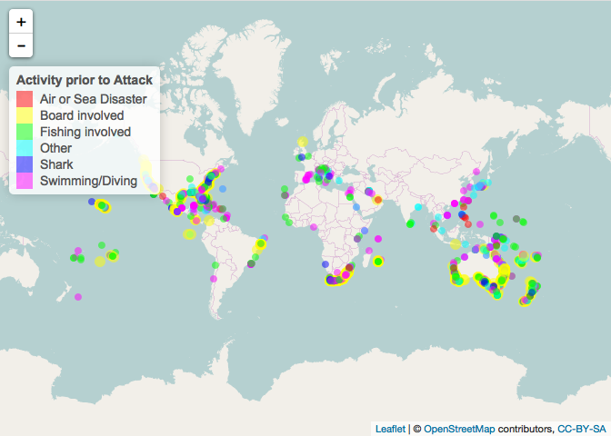

MATH 216 Data Science Final Project (Fall 2016)
================

-   Name: Kyra Gray
-   Project title: Global Shark Attacks Analysis
-   Write-up on RPubs: <http://rpubs.com/kyragray/235161>
-   Abstract:

The analysis conducted in the this project explores data drawm from a global shark attacks database dating back to the 1500s that can be accessed [here](https://www.kaggle.com/teajay/global-shark-attacks) on Kaggle. The data originally comes from the [Global Shark Attack File](http://www.sharkattackfile.net/index.htm) which I have assumed got its data from the [International Shark Attack File](https://www.flmnh.ufl.edu/fish/isaf/home/), due to some specific similarities in the description of the ISAF's database and the data I worked with. The original dataset included 16 original variables and of those 16 the variables that proved most relevant to my anlysis were Year, Type of Attack (provoked vs unprovoked), Country, Area, Location, the Activity was victim was engaging in when the attack occured, Injury, and Fatal (Y/N).

By creating leaflet plots of the location of each attack, I was able to portray regional trends of where attacks are happening by each variable of interest. Generally, shark attacks occur in the same overall regions across the globe, however there are slight location based trends for attacks that were fatal or occured while the victim was engaging an activity that was Board Involved, Fishing Involved Swimming/Diving. Additionally, the logistic regression model for predicting the fatality of an attack (using Activity, Location, and Type) accurately predicted a fatal attack 70% of the time.

    ## Warning: package 'ggplot2' was built under R version 3.3.2

    ## Warning: package 'colorspace' was built under R version 3.3.2

    ## Warning: Removed 28 rows containing missing values (geom_path).

    ## Warning: Removed 26 rows containing missing values (geom_point).

